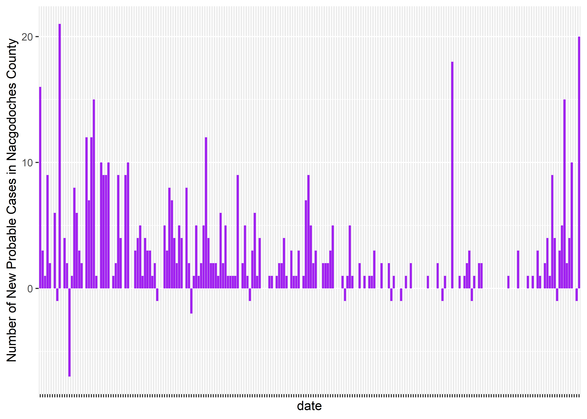

COVID by the Numbers
================
Robert Z. Selden, Jr.
10 August, 2021

## Encouraging data-driven decisions

Those data used on this page were harvested from the [Texas Department
of State Health
Services](https://www.dshs.state.tx.us/coronavirus/additionaldata.aspx)
daily, and visualizations were modeled in R. This exercise was generated
as a means for me to better understand the data, and the risk that local
COVID cases pose to my family. Knowledge is power in this situation,
and—when the mortality of those that I care about are at risk—I would
like to be as well-informed as possible.

The data and visualizations included below were built for my personal
use.

### Load libraries

``` r
# load libraries
library(tidyverse)
```

    ## -- Attaching packages --------------------------------------- tidyverse 1.3.1 --

    ## v ggplot2 3.3.5     v purrr   0.3.4
    ## v tibble  3.1.3     v dplyr   1.0.7
    ## v tidyr   1.1.3     v stringr 1.4.0
    ## v readr   2.0.0     v forcats 0.5.1

    ## -- Conflicts ------------------------------------------ tidyverse_conflicts() --
    ## x dplyr::filter() masks stats::filter()
    ## x dplyr::lag()    masks stats::lag()

``` r
library(here)
```

    ## here() starts at E:/github/covid

``` r
# prior to import the first two rows and first column (notes) were deleted
# notes regarding the dataset were also deleted
```

### How many active cases in Nacogdoches County?

``` r
# load data
daily.county <- read.csv("data/dailycasescounty.csv")

# select nacogdoches county
nac <- daily.county %>%
  filter(County == "Nacogdoches")

# print number of active cases in nacogdoches county
nac[,"Active.Cases.08.10", drop = FALSE]
```

    ##   Active.Cases.08.10
    ## 1                257

#### Plot active cases in 2021

``` r
# data wrangling
# data transposed and last five characters extracted from date column for plot

# load data
active <- read.csv("data/dailycasescounty2.csv")

# define variables for plot
# reformat date column to meet with ISO 8601 (yyyy-mm-dd)
date <- as.Date(active$date2,"%m/%d/%y")
dailyc <- active$cumulative

# barplot of daily cases
active.p <- ggplot(active, aes(x = date, y = dailyc)) +
  geom_bar(stat = "identity", fill = "purple") +
  theme(axis.text.x = element_blank()) +
  labs(y = "Number of Active Cases in Nacgodoches County")
active.p
```


### How many new confirmed cases?

``` r
# load data
daily.confirmed <- read.csv("data/newconfirmed.csv")

# select nacogdoches county
nac.confirmed <- daily.confirmed %>%
  filter(County == "Nacogdoches")

# print number of active cases in nacogdoches county
nac.confirmed[,"New.Cases.08.10.2021", drop = FALSE]
```

    ##   New.Cases.08.10.2021
    ## 1                   24

#### Plot new confirmed cases in 2021

``` r
# data wrangling
# data transposed and last five characters extracted from date column for plot

# load data
confirmed <- read.csv("data/newconfirmed2.csv")

# define variables for plot
# reformat date column to meet with ISO 8601 (yyyy-mm-dd)
date <- as.Date(confirmed$date,"%m/%d/%y")
dailyc <- confirmed$confirmed

# barplot of confirmed cases
confirmed.p <- ggplot(confirmed, aes(x = date, y = dailyc)) +
  geom_bar(stat = "identity", fill = "purple") +
  theme(axis.text.x = element_blank()) +
  labs(y = "Number of New Confirmed Cases in Nacgodoches County")
confirmed.p
```


### How many new probable cases?

``` r
# load data
new.prob <- read.csv("data/newprobable.csv")

# select nacogdoches county
nac.prob <- new.prob %>%
  filter(County == "Nacogdoches")

# print number of active cases in nacogdoches county
nac.prob[,"New.Probable.2021.08.10", drop = FALSE]
```

    ##   New.Probable.2021.08.10
    ## 1                      20

#### Plot new probable cases in 2021

``` r
# data wrangling
# data transposed and last five characters extracted from date column for plot

# load data
probable <- read.csv("data/newprobable2.csv")

# define variables for plot
# reformat date column to meet with ISO 8601 (yyyy-mm-dd)
date <- as.Date(probable$date,"%m/%d/%y")
dailyc <- probable$probable

# barplot of probable cases
probable.p <- ggplot(probable, aes(x = date, y = dailyc)) +
  geom_bar(stat = "identity", fill = "purple") +
  theme(axis.text.x = element_blank()) +
  labs(y = "Number of New Probable Cases in Nacgodoches County")
probable.p
```



### Cumulative cases in Nacogdoches County

``` r
# load data
cumulative.cases <- read.csv("data/casecount.csv")

# select nacogdoches county
nac.cumulative <- cumulative.cases %>%
  filter(County.Name == "Nacogdoches")

# print number of active cases in nacogdoches county
nac.cumulative[,"Cases.08.10.2021", drop = FALSE]
```

    ##   Cases.08.10.2021
    ## 1             4200

#### Plot cumulative cases for 2021

``` r
# data wrangling
# data transposed and last five characters extracted from date column for plot

# load data
nac.cumulative.cases <- read.csv("data/casecount2.csv")

# define variables for plot
# reformat date column to meet with ISO 8601 (yyyy-mm-dd)
date <- as.Date(nac.cumulative.cases$date,"%m/%d/%y")
dailyc <- nac.cumulative.cases$cumulative

# barplot of new confirmed cases 2020-2021
confirmed.p <- ggplot(nac.cumulative.cases, aes(x = date, y = dailyc)) +
  geom_bar(stat = "identity", fill = "purple") +
  theme(axis.text.x = element_blank()) +
  labs(y = "Cumulative Cases in Nacgodoches County")
confirmed.p
```


